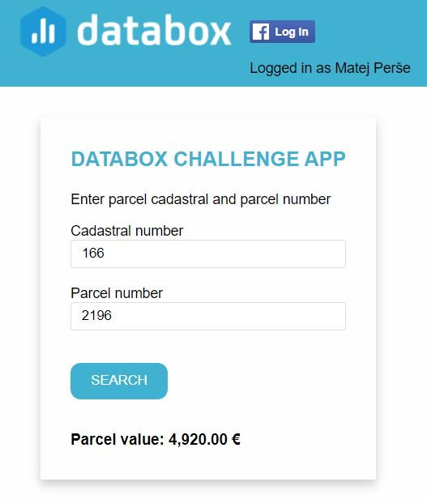

# Databox challenge app

This is a demo project for Databox challenge task. The project contains the code with all the requested functionality.

## Required functionality

- Get 5-10 metrics from two different APIs (we may add more of them later) or other
  sources and push them into Databox.
- At least one of those services has to use OAuth 2 authorization
- Min 50% unit test code coverage
- Simple deployment (keep in mind that someone will have to run the code)
- Periodic sending trigger
- Prepare the dashboard in Databox with the pushed data
- Storing the data locally (visualization is optional)
  1.  Service
  2.  Time of sending
  3.  Metrics sent to Databox
  4.  Number of KPIs sent
  5.  Sending successful or not
  6.  Error message (if sending unsuccessful)

## Results

- APIs: Code implements the calls to two different APIs - the Facebook API with the Oauth2 registration and simple GURS (demo) API for obtaining Slovenian real-estate data (only implemented for land parcels). Several KPI are generated from the data of the two services:

  1.  The Facebook service stores the following KPIs:

      - Time from the last Facebook post
      - Number of Facebook pages that the logged in user owns
      - Number of post in the last 30 days
      - Number of liked pages

  2.  GURS service stores the data about:
      - Records about individual service requests
      - Parcel value on individual day (the values are mocked since the original server data do not change)
      - Parcel size on individual day (the values are mocked since the original server data do not change)

- Unit testing: Unit tests for relevant functionality were implemented.

- Periodic triggers: When the user is logged in to Facebook account the periodic trigger is activated on the server that sends the updated data to Databox every 30 seconds. (The trigger can be disabled on the application - see the "STOP UPDATING BUTTON" near the login button).

- Visualization: The dashboards with the visualized data can be obtained here:
  1.  https://app.databox.com/datawall/3925795b60b5ffebc85374fb4d66779a060a638a5
  2.  https://app.databox.com/datawall/e1e371da241e57985b8f0906e3d17997060a5a1a3
- Logging: Besides the ordinary server log (see /logs/databox_importer.log), the databox wrapper class also stores a separate file with the requested information (see logs/databoxReport.txt)

## How to run

Start the appRun task with gradle (gradle appRun) and open the local demo url http://localhost:8080/databox-importer/

## App functionality

- Try to login to Facebook account (automatic login doesn't work due to Facebook API limitations for the html files) and observe the visualization.
- Check the visualization - data about your Facebook activity should be displayed.
- Observe the log (databox_importer.log) or the reports file (databoxReport.txt). There should be a new record present every 30 seconds.
- Enter the cadastral code and parcel number (one example entered by default). Additional examples:

  1. ko:1723 p:421
  2. ko:1911 p:849/38
  3. ko:2605 p:1488/13
  4. Parcel information can also be obtained from http://prostor3.gov.si/javni/login.jsp?jezik=sl).

5. After the query is performed and the value is displayed on the application the visualization should change displaying the mocked changes in the parcel values and increased number of performed requests.

Enjoy !!

## Authors

- [Matej Perse](https://github.com/mperse)
